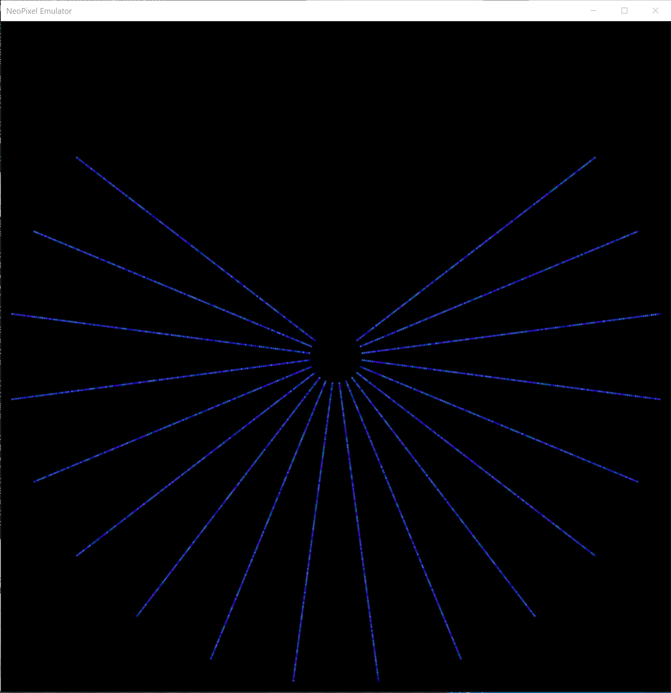
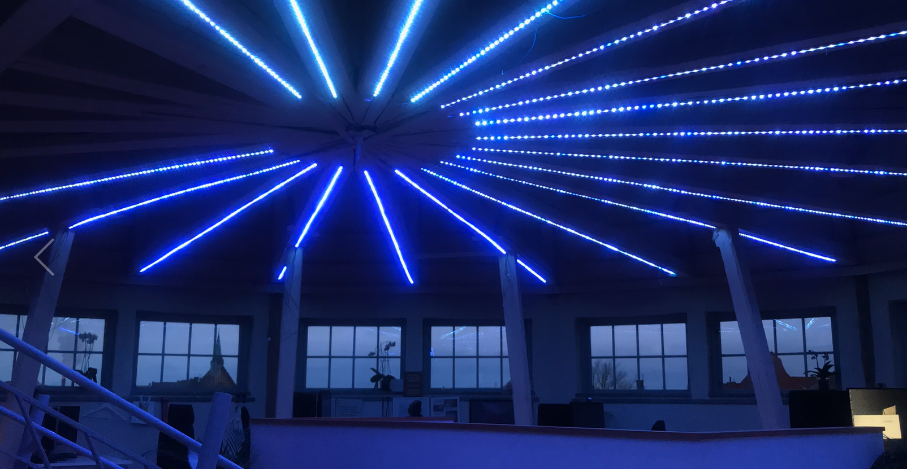

### Alitude Lights NeoPixel Emulator



This is a tool to speed up development of animated patterns for [WS2812B](https://www.adafruit.com/datasheets/WS2812B.pdf) RGB LEDs that are supported by the [Adafruit NeoPixel](https://www.adafruit.com/category/168) [library for Arduino](https://learn.adafruit.com/adafruit-neopixel-uberguide/arduino-library). It consists of a library that has the same interface as the NeoPixel library but that, instead of writing to actual WS2812B LEDs, renders the LEDs on screen using OpenGL. In addition, there's simple adapter code and implementations of a couple of the most common functions used in Arduino sketches (`delay()`, `random()` and `millis()`).

#### Competition



Help us code the coolest pixel patterns and win a brand new [thing] at the end of this summer.

##### Your code
The code is going to be imported and run in our physical installation for validation. The hardware we use is a [Particle photon](https://docs.particle.io/guide/getting-started/intro/photon/) and some functionality in the emulator might not be compatible with the photon libraries. So be careful with advanced code or external libraries.

### Setup and Use
These instructions should work on Ubuntu on WSL, Ubuntu, Mint and other Debian based systems.

##### Linux subsystem
If you are a Windows 10 user like me follow this guide to run the code on "Windows Subsystem for Linux" (WSL).
If know what you are doing or if you are a linux user, just clone the code and skip the WSL steps. 
```Powershell
Enable-WindowsOptionalFeature -Online -FeatureName Microsoft-Windows-Subsystem-Linux
```
Restart you Computer

##### Install Ubuntu on Windows 10
[Ubuntu Windows 10](https://www.microsoft.com/en-us/store/p/ubuntu/9nblggh4msv6)

##### Update and upgrade

    $ sudo apt-get update
    $ sudo apt-get upgrade

##### Install git

    $ sudo apt-get install git

##### Graphic support for WSL
Install [vcxsrv](https://sourceforge.net/projects/vcxsrv/)

    $ export DISPLAY=:0
    $ echo "export DISPLAY=:0.0" >> ~/.bashrc
    $ sudo touch /etc/dbus-1/session.conf
    $ sudo sed -i 's/<listen>.*<\/listen>/<listen>tcp:host=localhost,port=0<\/listen>/' /etc/dbus-1/session.conf

    $ sudo apt-get install ubuntu-desktop
    $ sudo apt-get install unity
    $ sudo apt-get install compiz-core
    $ sudo apt-get install compizconfig-settings-manager


##### Compiler and stuff

    $ sudo apt-get install build-essential

##### freeGLUT

    $ sudo apt-get install freeglut3-dev

##### source
Grab the code directly from this repository:

    $ git clone https://github.com/Altitude365/AltitudeLights.git
    $ cd AltitudeLights

##### makeheaders

    $ wget http://www.hwaci.com/sw/mkhdr/makeheaders.c
    $ gcc -o makeheaders makeheaders.c

##### OpenGL

    $ sudo apt-get install mesa-common-dev


##### Run the emulator

    $ ./make.sh && ./emulator
    
##### Create and win!!!

    $ nano ./arduino_sketch.cpp


#### Notes

* The setup contains of 18 neopixel stripes each of 150 neopixles. 

* The first pixel of each strip is closes to the center. 

* Pixels are addressed from 0-2699. First pixel of each strip is a factor of 150.  0, 150, 300 .. 1550

* Stripes are ordered counterclockwise.

* The `setBrightness()` call is ignored by the emulator and the `getBrightness()` call always returns the maximum brightness value of 255. As described on the [NeoPixel library home page](https://learn.adafruit.com/adafruit-neopixel-uberguide/arduino-library), `setBrightness()` is "lossy" and intended for use only in `setup()`, not in animations. Since physical LEDs are brighter than a computer monitor even on low brightness settings, the LEDs are most accurately represented by rendering them with maximum brightness. By having the emulator ignore `setBrightness()`, the call can be used in the sketch to set the brightness of the physical LEDs without affecting the accuracy of the representation in the emulator and without the developer having to adjust the value when switching between the emulator and physical LEDs.

* `delay()` should always be called in the animation loop, typically after each call to `pixels.show()`. A delay of 20ms corresponds to a maximum refresh rate of 50Hz (1 / 0.02) and is typically a good value to start with. Refreshing the LEDs more often (delay value lower than 20ms) will probably not cause animations to look any smoother. To speed up the animation it's probably better to increase the step size than the refresh rate.     

* The emulator does not take into account that code runs more slowly on the device than on the PC. On the PC, virtually all the time will be spent in `delay()` calls but on the device, a non-significant portion of time is typically spent executing the program. The difference causes the sketch to run faster on the PC. The possible difference becomes larger the shorter the `delay()` is.

